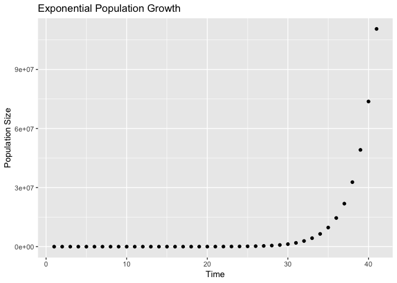
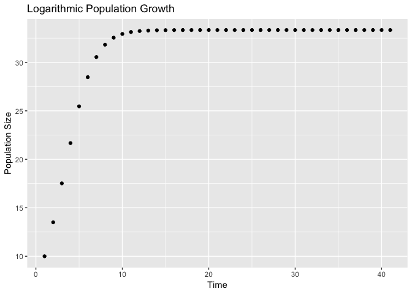

Writing Functions in R
================
Roya Safaeinili

``` r
library(tidyverse)
```

    ## ── Attaching packages ───────────────────────────────────────────────────────────────────── tidyverse 1.2.1 ──

    ## ✔ ggplot2 3.0.0     ✔ purrr   0.2.5
    ## ✔ tibble  1.4.2     ✔ dplyr   0.7.6
    ## ✔ tidyr   0.8.1     ✔ stringr 1.3.1
    ## ✔ readr   1.1.1     ✔ forcats 0.3.0

    ## Warning: package 'dplyr' was built under R version 3.5.1

    ## ── Conflicts ──────────────────────────────────────────────────────────────────────── tidyverse_conflicts() ──
    ## ✖ dplyr::filter() masks stats::filter()
    ## ✖ dplyr::lag()    masks stats::lag()

Today we will be learning to write our own functions in R.

``` r
exp_growth <- function(xt,r){
  r * xt
}

simulate <- function(max_time, x0, r){
  
  x <- numeric(max_time)
  x[1] <- x0
  
  for (t in 1:(max_time - 1)){
    x[t+1] <- exp_growth(x[t],r)
  }
  
  pop_data <- data_frame(time = 1:max_time, population_size = x)
  pop_data
  
  
}

simulate(41,10,1.5)
```

    ## # A tibble: 41 x 2
    ##     time population_size
    ##    <int>           <dbl>
    ##  1     1            10  
    ##  2     2            15  
    ##  3     3            22.5
    ##  4     4            33.8
    ##  5     5            50.6
    ##  6     6            75.9
    ##  7     7           114. 
    ##  8     8           171. 
    ##  9     9           256. 
    ## 10    10           384. 
    ## # ... with 31 more rows

``` r
simulate(41,10,1.5) %>%
  ggplot( aes(x = time, y = population_size)) +
      geom_point() +
      xlab('Time') +
      ylab('Population Size') + 
      ggtitle('Exponential Population Growth')
```


$$x\_{t+1} = r x\_t \\left(1-\\frac{x\_t}{K}\\right)$$

``` r
growth <- function(xt, r, K){
  x_t <- r * xt*(1-(xt/K))
}


simulate2 <- function(max_time, x0, r, K){
  
  x <- numeric(max_time)
  x[1] <- x0
  
  for (t in 1:(max_time - 1)){
    x[t+1] <- growth(x[t],r,K)
  }
  
  pop_data <- data_frame(time = 1:max_time, population_size = x)
  pop_data
}

simulate2(41,10,1.5,100) %>%
  ggplot(aes(time,population_size)) +
  geom_point() +
  xlab('Time') +
  ylab('Population Size') + 
  ggtitle('Logarithmic Population Growth')
```


